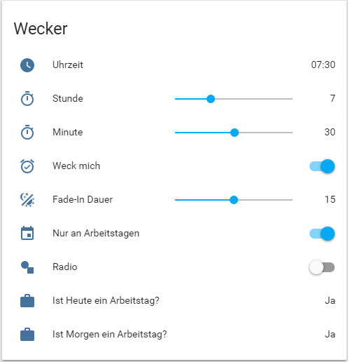
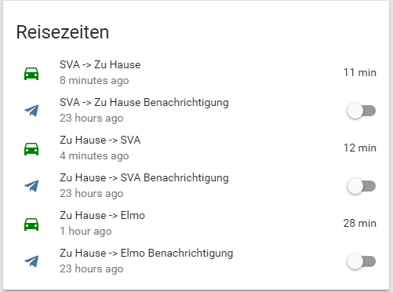
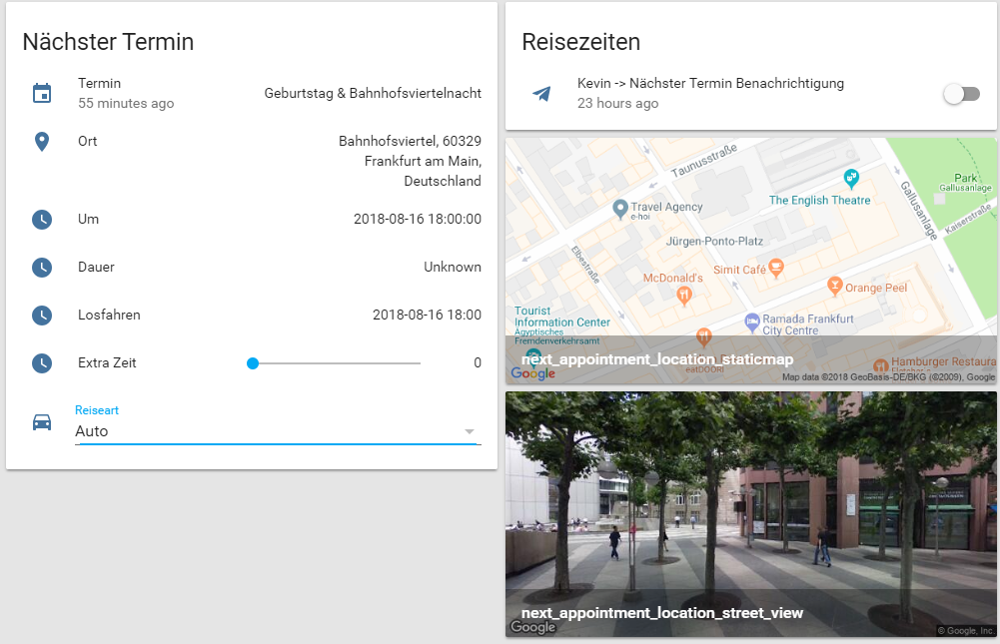
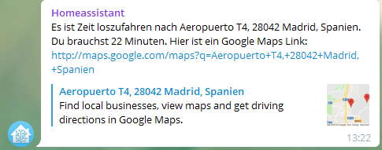
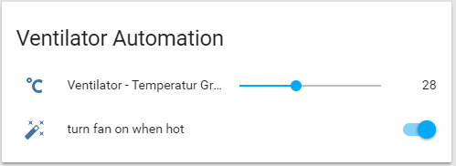

<h1 align="center">
  <a name="logo" href=""></a>
  <br>
  eifinger's Appdaemon Scripts
</h1>
<h4 align="center">Be sure to :star: my repo so you can keep up to date on the daily progress!.</h4>

## About
This is the repository containing all my Appdaemon apps.

Used together with my Homeassistant config which you can find here:

[https://github.com/eifinger/homeassistant-config](https://github.com/eifinger/homeassistant-config)

I use Appdaemon for all my automations since I am a programmer myself and it provides me with all the possibilities of the Python world and a far better debugging experience than [HA Automations](https://www.home-assistant.io/getting-started/automation/) or [nodered](https://nodered.org/).

This is a continuous work in progress and I am no real Python programmer. So any comments are highly appreciated.

## How to contribute
Just open an Issue or a Pull Request for any Comments, Questions, etc.

**Or you can message me on twitter :** [@eifinger](https://twitter.com/eifinger)

## How to use
If you have never used Appdaemon before I suggest you start with the [tutorial](https://appdaemon.readthedocs.io/en/latest/TUTORIAL.html) and the [guide](https://appdaemon.readthedocs.io/en/latest/APPGUIDE.html). Both contain more links to great tutorials and examples.

I tried to write each App in this repository with reusability in mind. This means that every app in here has a short documentation and is (if possible) written to be easily adjusted to your environment and your needs.

### globals and secrets
As there is currently no functionality for secrets like there is for the HA config I am using [globals.py](globals.py) where I implemented the methods ``get_arg`` and ``get_arg_list`` which do nothing else than the standard ``self.args["argname"]`` but if the argument starts with ``secret`` it will search for actual value of the argument using a dictionary in the module ``secrets.py``. As I don't upload this file to github I included the file [travis_secrets.py](travis_secrets.py) to make it easier to retrace for others.

### app_switch
Every App has an input_boolean inside HA which turns it on/off. This is useful if I don't want any notifications right now or an App is misbehaving.

## App list

*   [Alexa Intents](#alexaintents)
*   [alarmClock](#alarmclock)
*   [bedRoomMotionTrigger](#bedroommotiontrigger)
*   [buttonClicked](#buttonclicked)
*   [comingHome](#cominghome)
*   [detectDoorOpenWhenGoingToBed](#detectdooropenwhengoingtobed)
*   [detectWrongStateWhenLeaving](#detectwrongstatewhenleaving)
*   [eventMonitor](#eventmonitor)
*   [faceRecgonitionBot](#facerecognitionbot)
*   [google_travel_time](#google_travel_time)
*   [headingToZoneNotifier](#headingtozonenotifier)
*   [homeArrivalNotifier](#homearrivalnotifier)
*   [isHomeDeterminer](#ishomedeterminer)
*   [isUserHomeDeterminer](#isuserhomedeterminer)
*   [leavingZoneNotifier](#leavingzonenotifier)
*   [motionTrigger](#motiontrigger)
*   [newWifiDeviceNotify](#newwifidevicenotify)
*   [nextAppointmentLeaveNotifier](#nextappointmentleavenotifier)
*   [notifyFailedLogin](#notifyfailedlogin)
*   [notifyOfActionWhenAway](#notifyofactionwhenaway)
*   [plantWateringNotifier](#plantwateringnotifier)
*   [powerUsageNotification](#powerusagenotification)
*   [roomBasedLightControl](#roombasedlightcontrol)
*   [setMediaPlayerSource](#setMediaPlayerSource)
*   [sleepModeHandler](#sleepmodehandler)
*   [standardSetter](#standardsetter)
*   [turnFanOnWhenHot](#turnfanonwhenhot)
*   [turnOffBarAfterRestart](#turnoffbarafterrestart)
*   [facebox](#facebox)
*   [notify](#notify)

### AlexaIntents

Are explained [here](alexa/README.md)
### alarmClock
Alarm Clock App inspired by [this](https://community.home-assistant.io/t/creating-a-alarm-clock/410) forum post.
It fades in my bedroom light and sends a notifcation. The fade in and alarm time is defined by input_number sliders in HA
```yaml
alarmClock:
  module: alarmClock
  class: AlarmClock
  alarm_time: sensor.alarm_time
  wakemeup: input_boolean.wakemeup
  naturalwakeup: input_number.alarm_natural_wakeup_fade_in
  alarmweekday: input_boolean.alarmweekday
  radiowakeup: input_boolean.radiowakeup
  #TODO radioplayer: input_select.wakeup_radioplayer
  wakeup_light: light.bedroom_yeelight
  isweekday: binary_sensor.workday_today
  notify_name: group_notifications
  message_DE: "Guten Morgen!"
  message_EN: "Good Morning!"
  global_dependencies:
    - globals
```

### bedRoomMotionTrigger
Special version of Motion Trigger. Only trigger when Door is not open (dont want any mosquittos) and only trigger when not both smartphones are in bedroom
```yaml
bedroomMotionTrigger:
  module: bedroomMotionTrigger
  class: BedroomMotionTrigger
  app_switch: input_boolean.bedroom_motion_trigger
  sensor: binary_sensor.motion_sensor_158d0002006cfa
  entity_on: light.bedroom_yeelight
  after_sundown: True
  after: "22:00"
  constraint_entities_off: binary_sensor.door_window_sensor_158d0001bb4d94
  location_user_one_sensor: sensor.location_user_one
  location_user_two_sensor: sensor.location_user_two
  bedroom_state: Schlafzimmer
```
### buttonClicked
My multipurpose App to link any switch/light to a Xiaomi Button
```yaml
xiaomiroundButtonBedroomClicked:
  module: buttonClicked
  class: ButtonClicked
  sensor: binary_sensor.switch_158d0001b12a12
  actor_single: light.bedroom_yeelight
  actor_double: group.all
```
### comingHome
When the front door openes and no one was home before this will turn on something. I am using it to turn on the light (if the sun is down) and turn on the receiver so I can hear Alexa
```yaml
comingHomeYeelight:
  module: comingHome
  class: ComingHome
  app_switch: input_boolean.coming_home_yeelight
  sensor: binary_sensor.door_window_sensor_158d000126a57b
  isHome: input_boolean.is_home
  actor: switch.large_lamp
  after_sundown: True
```
### detectDoorOpenWhenGoingToBed
During this hot summer in Germany we somethimes forgot to close the terrace door before going to bed. This will check if the Xiaomi Door/Window Sensor reports the door being open if the [sleepmode](sleepModeHandler/sleepModeHandler.py) is turned on.
```yaml
detectDoorOpenWhenGoingToBed:
  module: detectDoorOpenWhenGoingToBed
  class: DetectDoorOpenWhenGoingToBed
  app_switch: input_boolean.detect_door_open_when_going_to_bed
  sensor: binary_sensor.door_window_sensor_158d000205b808
  entity: input_boolean.sleepmode
  after_sundown: True
  notify_name: group_notifications
  message_DE: "Du hast {} offen gelassen Dummie."
  message_EN: "You left open {} Dummy."
  global_dependencies:
    - globals
```
### detectWrongStateWhenLeaving
Checks a list of entities which should be on/off when everybody left the house. If something isn't right it will try to turn it off (e.g. a light) and send a notification.
```yaml
detectWrongStateWhenLeaving:
  module: detectWrongStateWhenLeaving
  class: DetectWrongStateWhenLeaving
  app_switch: input_boolean.detect_wrong_state_when_leaving
  entities_off: "binary_sensor.door_window_sensor_158d000205b808,binary_sensor.door_window_sensor_158d00020499ad,\
  binary_sensor.door_window_sensor_158d0002059ddf,media_player.denon_avrx1300w,switch.large_lamp,\
  switch.small_lamp,switch.snowboard,light.bedroom_yeelight,light.bar_table,light.lobby_yeelight,\
  light.reading_lamp_yeelight,light.treppe_oben,light.stairs_lower_yeelight,switch.ventilator"
  message_DE: "Du hast {} angelassen. Ich habe es für dich ausgemacht."
  message_EN: "You left on {}. I turned it off for you"
  message_off_DE: "Du hast {} vergessen anzumachen. Ich habe es für dich angemacht."
  message_off_EN: "You forgot to turn on {}. I turned it on for you"
  message_reed_DE: "Du hast {} offen gelassen Dummie."
  message_reed_EN: "You left open {} Dummy."
  message_reed_off_DE: "Du hast {} zu gelassen Dummie."
  message_reed_off_EN: "You left {} closed Dummy."
  isHome: input_boolean.is_home
  global_dependencies:
    - globals
```
### eventMonitor
Monitor all events. Useful for debugging and developing
```yaml
eventMonitor:
  module: eventMonitor
  class: Monitor
  events: 
```
### faceRecognitionBot
COMING SOON
### google_travel_time
Monitors my Google Travel Time Sensors e.g. between home and work. I can enable an input_boolean in HA which causes this App to send me a notication as soon as the traffic is in an acceptable range. I use this drive to/from work when there is the least traffic.
```yaml
googleTravelTime_home_from_work:
  module: google_travel_time
  class: GoogleTravelTime
  sensor: sensor.travel_time_home_from_work
  notify_input_boolean: input_boolean.travel_time_home_from_work
  notify_name: group_notifications
  message_DE: "Du kannst losfahren nach {}"
  message_EN: "You can start your journey to {}"
  global_dependencies:
    - globals 
```

### headingToZoneNotifier
Currently not used
### homeArrivalNotifier
Greet the person coming home with a notification
```yaml
homeArrivalNotifierUserOne:
  module: homeArrivalNotifier
  class: HomeArrivalNotifier
  app_switch: input_boolean.home_arrival_notifier_user_one
  input_boolean: input_boolean.user_one_home
  notify_name: group_notifications
  user_name: secret_name_user_one
  zone_name: Home
  message_DE: "Willkommen zu Hause {}."
  message_EN: "Welcome Home {}."
  global_dependencies:
    - globals
```
### isHomeDeterminer
Controls an input_boolean "isHome" which is used as a trigger for other Apps.
The state depends on other input_booleans controlled by the [isUserHomeDeterminer](isUserHomeDeterminer/isUserHomeDeterminer.py)
```yaml
isHomeDeterminer:
  module: isHomeDeterminer
  class: IsHomeDeterminer
  app_switch: input_boolean.is_home_determiner
  ishome: input_boolean.is_home
  input_booleans: input_boolean.user_one_home,input_boolean.user_two_home
  message_DE: "Es ist keiner mehr zu Hause. Setze isHome auf off"
  message_EN: "Everyone left home. Setting isHome to off"
  global_dependencies:
    - globals
```
### isUserHomeDeterminer
The GPS Logger tells me where someone is. But I want to know for sure who just came in the door.
App to toggle an input boolean when a person enters or leaves home.
This is determined based on a combination of a GPS device tracker and the door sensor.
- If the door sensor opens and the device_tracker changed to "home" in the last self.delay minutes this means someone got home
- If the door sensor opens and the device_tracker changes to "not_home" in the next self.delay minutes this means someone left home
```yaml
isUserHomeDeterminerUserOne:
  module: isUserHomeDeterminer
  class: IsUserHomeDeterminer
  app_switch: input_boolean.is_user_home_determiner_user_one
  input_boolean: input_boolean.user_one_home
  device_tracker: secret_device_user_one
  door_sensor: binary_sensor.door_window_sensor_158d000126a57b
  global_dependencies:
    - globals
```
### leavingZoneNotifier
Notify if a user is leaving a zone after being there for a certain amount of time. I use this to notify my SO that I am leaving work and driving home
```yaml
leavingWorkNotifierUserOne:
  module: leavingZoneNotifier
  class: LeavingZoneNotifier
  app_switch: input_boolean.leaving_work_notifier_user_one
  device: secret_device_user_one
  user_name: secret_name_user_one
  lingering_time: 3600
  delay: 120
  zone: Work
  notify_name: group_notifications
  message_DE: "{} hat {} vor {} Minuten verlassen."
  message_EN: "{} left {} {} minutes ago"
  global_dependencies:
    - globals
```
### motionTrigger
Turn something on/off when a motion sensor turns on. Automatically turn it off again after a delay.
```yaml
obenTreppeMotionTrigger:
  module: motionTrigger
  class: MotionTrigger
  app_switch: input_boolean.oben_treppe_motion_trigger
  sensor: binary_sensor.motion_sensor_158d00012aab97
  entity_on: light.treppe_oben
  entity_off: light.treppe_oben
  after_sundown: True
  global_dependencies:
    - globals
```
### newWifiDeviceNotify
Actually a wrong name. This will send me a notification when any device_tracker component detects a new device. I initally thought to use this as a security feature but found it quite useful when adding new Sonoff switches and such. I get a notification if the setup was successfull.

**Version 1.2:**
Displays two buttons which let me control the internet access for the new device. My fritzbox standard profile denies internet access. With this I can easily allow my guests access to the internet without logging in to my fritzbox manually.

```yaml
newWifiDeviceNotify:
  module: newWifiDeviceNotify
  class: DeviceNotify
  notify_name: group_notifications
  message_DE: "Unbekanntes Gerät entdeckt. Hostname: {}. MAC: {}."
  message_EN: "Unknown device connected. Hostname: {}. MAC: {}"
  global_dependencies:
    - globals
```
### nextAppointmentLeaveNotifier
Send me a notification when it is time to leave for my next appointment based on my current location. Inspired by [this](https://community.home-assistant.io/t/text-to-speech-notification-to-leave-for-appointment/8689) blog post.
- Selectable travel mode (car/bus/walk/bike)
- Only for google calendar events which have a location
- Adjustable offset when to notify
- Includes a direct Google Maps Navigation Link in Notification Message
Saved my ass quite a few times
```yaml
nextApppointmentLeaveNotifier:
  module: nextApppointmentLeaveNotifier
  class: NextApppointmentLeaveNotifier
  sensor: sensor.calc_leave_time
  notify_input_boolean: input_boolean.announce_time_to_leave
  notify_name: group_notifications
  input_number: input_number.leave_time_offset
  destination_name_sensor: sensor.cal_next_appointment_location
  travel_time_sensor: sensor.travel_time_next_appointment_location
  message_DE: "Es ist Zeit loszufahren nach {}. Du brauchst {} Minuten. Hier ist ein Google Maps Link: {}"
  message_EN: "It's time to leave to {}. It will take {} minutes. Here is a Google Maps Link: {}"
  global_dependencies:
    - globals
```


### notifyFailedLogin
Send a notification on a failed login.
```yaml
notifyFailedLogin:
  module: notifyFailedLogin
  class: NotifyFailedLogin
  notify_name: group_notifications
  message_DE: "Alarm: {}"
  message_EN: "Alarm: {}"
  global_dependencies:
    - globals
```

### notifyOfActionWhenAway
Notify me of any event for a list of entities when no one is at home.
For example a door being openend or a motion sensor triggered
```yaml
notifyOfActionWhenAway:
  module: notifyOfActionWhenAway
  class: NotifyOfActionWhenAway
  app_switch: input_boolean.notify_of_action_when_away
  sensor: "binary_sensor.door_window_sensor_158d000126a57b,binary_sensor.door_window_sensor_158d0001bb4d94,\
  binary_sensor.door_window_sensor_158d0001bb4dc0,binary_sensor.door_window_sensor_158d000205b808,\
  binary_sensor.door_window_sensor_158d000205b82e,binary_sensor.door_window_sensor_158d00020498b6,\
  binary_sensor.door_window_sensor_158d000204ba26,binary_sensor.door_window_sensor_158d0002059ddf,\
  binary_sensor.door_window_sensor_158d00020499ad,binary_sensor.door_window_sensor_158d0002048951,\
  binary_sensor.door_window_sensor_158d00020455bf,binary_sensor.motion_sensor_158d00012aab97,\
  binary_sensor.motion_sensor_158d0001fa464b,binary_sensor.motion_sensor_158d0002006cfa"
  isHome: input_boolean.is_home
  user_name: group_notifications
  isHome_delay: 20
  message_DE: "Alarm: {} ist gewechselt auf {}"
  message_EN: "Alarm: {} changed to {}"
  global_dependencies:
    - messages
    - globals
```

### plantWateringNotifier
Remind us to water the plants in the morning when the precipiation propability is too low. This uses a Telegram Chatbot. We can press a button in the notification to tell the App that we watered the plants. If we don't do that we get reminded again in the evening.
```yaml
plantWateringNotifier:
  module: plantWateringNotifier
  class: PlantWateringNotifier
  app_switch: input_boolean.plant_watering_notifier
  rain_precip_sensor: sensor.dark_sky_precip_probability
  rain_precip_intensity_sensor: sensor.dark_sky_precip_intensity
  precip_type_sensor: sensor.dark_sky_precip
  notify_name: group_notifications
  user_id: secret_telegram_user_id
  reminder_acknowledged_entity: input_boolean.persistence_plantwateringnotifier_reminder_acknowledged
  message_DE: "Die Regenwahrscheinlichkeit beträgt heute nur {}. Vergiss nicht die Pflanzen zu gießen!"
  message_EN: "The Rain Propability is only {}. Don't forget to water the plants!"
  message_not_needed_DE: "Es wird heute mit einer Wahrscheinlichkeit von {} Prozent ungefähr {} Millimeter pro Stunde regnen. Du brauchst nicht selbst gießen."
  message_not_needed_EN: "It will rain today {} millimeter per hour with a propability of {}. You don't have to water your plants"
  message_evening_DE: "Ich bin mir nicht sicher ob du vergessen hast die Pflanzen zu gießen, deswegen erinnere ich dich lieber noch einmal daran."
  message_evening_EN: "I'm not sure whether you waterd your plants, so I thought I better remind you again"
  global_dependencies:
    - globals
    - messages
```


### pollenNotifier
Notify in the morning if any monitored pollen level is above a threshold.
```yaml
roggenNotifier:
  module: pollenNotifier
  class: PollenNotifier
  app_switch: input_boolean.roggen_notifier
  pollen_sensor: sensor.pollen_101_roggen_today
  pollen_name: Roggen
  notify_name: group_notifications
  notify_time: 08:00
  notify_threshold: 1.0
  message_DE: "{} ist {} {} Belastung."
  message_EN: "The {} intensity {} is {}."
  message_no_data_DE: "Ich habe {} leider keine Daten für {}."
  message_no_data_EN: "{} I have no pollen data for {}."
  global_dependencies:
    - globals
```

### powerUsageNotification
Notify when the Washingmachine or Dishwasher started/finished. Using power measured by TP HS110 Plugs like[](https://www.amazon.de/dp/B017X72IES/ref=twister_B07CQBCZ5G)
```yaml
powerUsageNotification_Dishwasher:
  module: powerUsageNotification
  class: PowerUsageNotification
  app_switch: input_boolean.power_usage_notification_dishwasher
  sensor: sensor.dishwasher_power_usage
  notify_name: group_notifications
  delay: 1260 #21 minutes
  threshold: 2
  alternative_name: Die Spülmaschine
  message_DE: "{} ist gestartet."
  message_EN: "{} just started."
  message_off_DE: "{} ist fertig."
  message_off_EN: "{} just finished."
  global_dependencies:
    - globals
```

### roomBasedLightControl
BETA
Turn the light on based on which room my smartphone is currently being determined by [find3](https://github.com/schollz/find3)
```yaml
roomBasedLightControl:
  module: roomBasedLightControl
  class: RoomBasedLightControl
  room_sensor: sensor.mqtt_room_user_one
  entity: input_boolean.room_based_light
  mappings:
    livingroom:
      room: livingroom
      entity: switch.large_lamp
    kitchen:
      room: kitchen
      entity: switch.large_lamp
    bedroom:
      room: bedroom
      entity: light.bedroom_yeelight
  global_dependencies:
    - globals
```
### setMediaPlayerSource
App which sets media player source on based on a entity state.
I currently use this to turn on multi room audio when getting up.
```yaml
setMultiRoomAudioWhenSleepModeTurnsOff:
  module: setMediaPlayerSource
  class: SetMediaPlayerSource
  app_switch: input_boolean.set_multiroom_audio_when_sleepmode_turns_off
  trigger_entity: input_boolean.sleepmode
  trigger_state: "off"
  media_player: media_player.spotify
  source: Wohnung
  global_dependencies:
    - globals
```
### sleepModeHandler
Set an input_boolean on/off. Used as a trigger for other Apps.
Currently only controlled by ``Alexa, guten Morgen`` ``Alexa, gute Nacht``
### standardSetter
Set back some HA entities back to their standard values.
Configurable in the HA frontend. Currently used to set back the next the [nextAppointmentLeaveNotifier](#nextAppointmentLeaveNotifier) to my configured default value.
```yaml
standardSetterTravelModeNextAppointment:
  module: standardSetter
  class: StandardSetter
  entity: input_select.next_appointment_travel_mode
  standard_entity: input_select.next_appointment_travel_mode_standard
  trigger_entity: sensor.cal_next_appointment_title
  global_dependencies:
    - globals
```

### turnFanOnWhenHot
Turns the Fan on when the temperature is above a configurable threshold and someone is in the room ([find3](https://github.com/schollz/find3))
```yaml
turnFanOnWhenHot:
  module: turnFanOnWhenHot
  class: TurnFanOnWhenHot
  app_switch: input_boolean.turn_fan_on_when_hot
  temp_sensor: sensor.large_lamp_temperature
  threshold_entity: input_number.turn_fan_on_when_hot_threshold
  location_sensors: sensor.location_user_one,sensor.location_user_two
  room: Wohnzimmer
  actor: switch.large_ventilator
  delay: 120
  global_dependencies:
    - globals
```

### turnOffBarAfterRestart
As I sometimes restart HA when working on it from remote I turn the Bar lights to red with [this script](https://github.com/eifinger/homeassistant-config/blob/master/updateHomeassistant.sh). This way everyone can see HA is currently unavailable. If it comes back up again this app will turn the light green and then off. 
### facebox
IN DEVELOPMENT
Use Facebox to announce who is at the door.
Automatically send a notfication if an unkwon face is detected.
Automatic selflearning with reinforced learning based on a telegram chatbot.
### notify
IN DEVELOPMENT
Centralizes messaging. Among other things, it will determine whether a user is at home and if yes in which room. 
Then Alexa in that room will be used additionally to Telegram
```yaml
Notify:
  module: notify
  class: Notify
  media_player: media_player.denon_avrx1300w
  source: CBL/SAT
  alexa_media_player: media_player.kevins_echo_dot_oben
  global_dependencies:
    - globals
```

# Thanks
First of all thanks to the Homeassistant Team and [Andrew Cockburn](https://github.com/acockburn) for making Appdaemon

Some of the Apps are taken from the official examples and many based on or at least inspired by [Rene Tode](https://github.com/ReneTode). For example his absolutely fantastic [Alexa-Appdaemon-App](https://github.com/ReneTode/Alexa-Appdaemon-App).